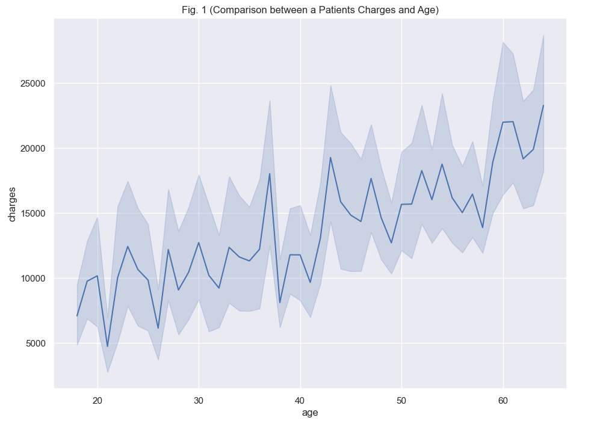
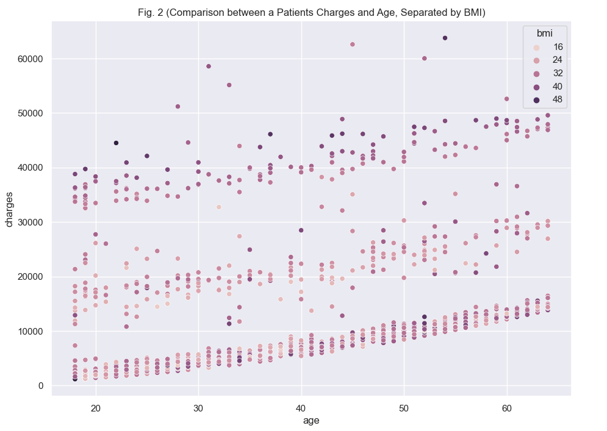
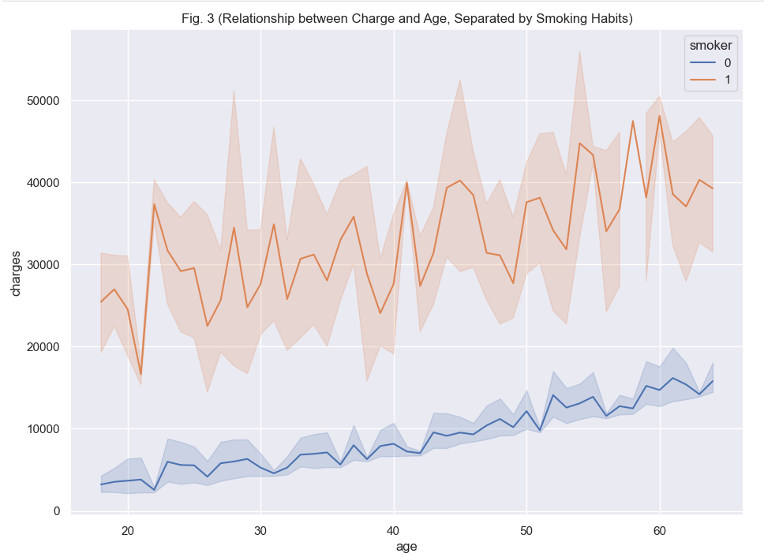

# COSC 301 Project Group 44 Final Report

## Introduction

Our group chose to move forward with a dataset that contains information on over 1300 U.S. patient's medical expenses and other attributes including their age, bmi, smoking habits, gender, and region. 

By understanding and analyzing the trends between these attributes and medical expenses, we can predict an individual's possible charges by comparing them to these groups. Such findings can even be used as an incentive and encourage a healthier lifestyle.
  

## EDA Summary

## Matt Visuals + Conclusion

## Bella Visuals + Conclusion

### Research Question:
Do medical charges rise as a person ages? And is it possible that their BMI or smoking habits may have influenced that?

### Visualizations: 
Age v. Charges Plot

Age v. Charges (Separated by BMI)

Age v. Charges (Separated by Smoking Habits)

### Conclusion:

The above three visualizations help me examine and answer my research question: Do medical charges rise as a person ages? And is it possible that their BMI or smoking habits may have influenced that?

The first visualization answers my central question concerning age and charges. The rising trendline is consistent throughout the visualizaton making it safe to conclude that the younger a person is, the lower their expenses are compared to others receiving the same treatments and costs. This is the common trendline that represents the proportional relationship between age and charge, whether that be because of age and the health issues that come with it or outside conditions.

That answers my first question, but what role do BMI and smoking have here?

The lower group's lighter colour in the BMI graph illustrates how people charged under $10 000 have a BMI of around 16 to 30. As you move upwards in charge, this colour gets darker, with those with the highest record charges having a BMI of over 40. Regardless of age, the higher BMI you have, the higher your medical expenses tend to be. However, it is not a huge difference and this does not entirely prove that BMI is a direct cause of these people's health issues but is instead a possibility.

Furthermore, Fig. 3 establishes that smoking does play a massive role in influencing charges regardless of age. Anyone charged under $15 000 is not a smoker, and all those above that charge are. The distinction in this graph is more straightforward compared to the BMI one.

After looking at these visualizations, I can conclude that age is proportional to medical expenses. Younger patients with charges over $45 000 may be due to other medical conditions, but overall, the relationship is consistent and medical expenses rise with age. Those with a BMI over 30 consistently pay slightly higher charges than those with a lower BMI. Furthermore, smokers continue to be charged up to $50 000 more than non-smokers.

View my notebook [here](notebooks/analysis2.ipynb)!

---
## Jolo Sesbreno - Analysis 3

### Question: 
As males and females age, what trends can be picked up in their medical expenses? At what point in their lives do they pay the highest?

### Visualizations
Male Data Frame:

Female Data Frame:

### Conclusion/Analysis:
To start, different individuals live very different lives which varies medical charges from person to person. This results in a plot with a lot of seemingly 'random' dots that point to each individual.

However, it is safe to conclude that as one ages, their medical expenses also increase, regardless of ones sex. 

With this, one noticeable difference is the consistency of the 'clumps' of people as the age goes up.

For males, there seems to be another consistent clump from around 15 thousand to 20 thousand and another smaller yet visible clump from 35 thousand to 45 thousand. 

For females, this appears more random as dots fluctuate the plot. These fluctations appear more commom in their 20s, then reduce in ther 30s and returns in their mid 40s onwards.

To conclude, there is no clear differences between medical expenses as people age within males and females. Together, medical expenses rise as people grow older. Males find themselves consistently paying higher charges that increase as they age; while females charges appears more random in the earlier ages, but then slowly pay at a steady rate.

### Note:
For a more in-depth analysis showing how the data is wrangled and how each visualization is coded. Visit [the full analysis notebook here](notebooks/analysis3.ipynb).