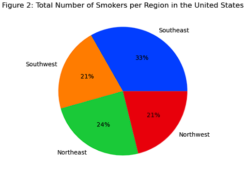

# COSC 301 Project Group 44 Final Report

## Introduction

Our group chose to move forward with a dataset that contains information on over 1300 U.S. patient's medical expenses and other attributes including their age, bmi, smoking habits, gender, and region. 

By understanding and analyzing the trends between these attributes and medical expenses, we can predict an individual's possible charges by comparing them to these groups. Such findings can even be used as an incentive and encourage a healthier lifestyle.
  

## EDA Summary

## Matt Visuals + Conclusion

### Research Question:

For this project, i was interested in to see if the region/location of a person holds a significance in terms of rising medical charges for patients in the United States. Moreover, I would like to analyze if there is any connection between the charges to a medical patient and the lifestyle of a patient as well using the 'bmi' and 'smoker' information. Perhaps this will highlight any medical inequalities with different regions in the United States and through this analysis, I hope to shed light on this topic. Given the time constraints I am unsure whether I could delve into this into detail but it would be fascinating to see whether a patient's location and lifestyle could affect medical charges. This leads me to the research questions I would like to answer

1. Does the region/location of a medical patient in the United States have a significant impact on rising costs? 
2. Does lifestyle play a significant role in medical costings for United States patients? If so how?

### Visualizations: 

Age v. Charges (Separated by BMI)

Age v. Charges (Separated by BMI)

Age v. Charges (Separated by Smoking Habits)

### Conclusion:

After examining a series of visualizations and the correlation of several aspects of the medical expenses dataset I was able to find an answer to whether lifestlyle and location affects the amount of medical charges charged to a patient. I have come to the conclusion that the region where the patient resides is closesly tied to the rising cost of medical expenses, not to mention that because they live in a certain region they are more likely to engage in activities such as smoking which could explain why there is a high frequency of low bmi in the plots above.  

Figure 4 displays both boxplots for smokers and non-smokers per region. It shows that smokers have a much higher cost of medical charges and are charged upwards of 12,000 USD, much higher than non smokers. In addition, majority of these smokers come from the southern regions of the united states which could entail that people are more likely to smoke here because of the quality of social, medical, or legal conditions. Perhaps their sin tax on cigarettes or tobacco is much lower compared to other states and thus people are more tempted/encouraged to use these products. 

Figure 5 shows the apparent correlations between bmi, medical charges, and smoker. There is a slight positive correlation between bmi and medical charges but the data is not that consistent to prove there is a strong correlation and may require other data to properly interpret. The scatterplot also suggests that there is a slight positive correlation between bmi and being a smoker as well meaning that smokers could possibly have lower bmi's due to loss of appetite and additional consumption of energy. Non-smokers are suggested to gain weight because of an increased appetite and perhaps the lack of exercise and proper diet, then again these are only assumptions based on the data. 

Figure 6 shows that the northern regions have lower bmi's than those of the southwest. Assuming this, it could be that the region does not dramatically impact a person's BMI, however, being a smoker may slightly be correlated to lower BMI's and non smokers to have higher BMI's. Overall it is difficult to say whether the region affects a patient's BMI. 

After thorough analysis and interpretation of the medical insurance dataset as well as the analysis on the data visualizations correlating characterisitcs such as region, charges, BMI, and smoking data, it appears that location and lifestyle defintiely influence the rising medical costs of a patient in the United States. In terms of location, the data shows that the region might have something to do with rising medical costs. This could be due to several factors such as social conditions and health benefits/policies of the states within the region. In terms of lifestyle, it would seem that being a smoker has something to do with rising medical costs as patients who smoked showed a bigger frequency of higher medical charges compared to non-smokers. BMI had a slight positive correlation but the data proved to be inconsistent with rising medical costs so it would be hard to determine without additional data. Although my research question was answered, there is still uncertainty when it comes to the relation of location and lifestyle with medical charges. 

## Bella Visuals + Conclusion

### Research Question:
Do medical charges rise as a person ages? And is it possible that their BMI or smoking habits may have influenced that?

### Visualizations: 
Age v. Charges Plot

Age v. Charges (Separated by BMI)

Age v. Charges (Separated by Smoking Habits)

### Conclusion:

The above three visualizations help me examine and answer my research question: Do medical charges rise as a person ages? And is it possible that their BMI or smoking habits may have influenced that?

The first visualization answers my central question concerning age and charges. The rising trendline is consistent throughout the visualizaton making it safe to conclude that the younger a person is, the lower their expenses are compared to others receiving the same treatments and costs. This is the common trendline that represents the proportional relationship between age and charge, whether that be because of age and the health issues that come with it or outside conditions.

That answers my first question, but what role do BMI and smoking have here?

The lower group's lighter colour in the BMI graph illustrates how people charged under $10 000 have a BMI of around 16 to 30. As you move upwards in charge, this colour gets darker, with those with the highest record charges having a BMI of over 40. Regardless of age, the higher BMI you have, the higher your medical expenses tend to be. However, it is not a huge difference and this does not entirely prove that BMI is a direct cause of these people's health issues but is instead a possibility.

Furthermore, Fig. 3 establishes that smoking does play a massive role in influencing charges regardless of age. Anyone charged under $15 000 is not a smoker, and all those above that charge are. The distinction in this graph is more straightforward compared to the BMI one.

After looking at these visualizations, I can conclude that age is proportional to medical expenses. Younger patients with charges over $45 000 may be due to other medical conditions, but overall, the relationship is consistent and medical expenses rise with age. Those with a BMI over 30 consistently pay slightly higher charges than those with a lower BMI. Furthermore, smokers continue to be charged up to $50 000 more than non-smokers.

View my notebook [here](notebooks/analysis2.ipynb)!

---
## Jolo Sesbreno - Analysis 3

### Question: 
As males and females age, what trends can be picked up in their medical expenses? At what point in their lives do they pay the highest?

### Visualizations
Male Data Frame:

Female Data Frame:

### Conclusion/Analysis:
To start, different individuals live very different lives which varies medical charges from person to person. This results in a plot with a lot of seemingly 'random' dots that point to each individual.

However, it is safe to conclude that as one ages, their medical expenses also increase, regardless of ones sex. 

With this, one noticeable difference is the consistency of the 'clumps' of people as the age goes up.

For males, there seems to be another consistent clump from around 15 thousand to 20 thousand and another smaller yet visible clump from 35 thousand to 45 thousand. 

For females, this appears more random as dots fluctuate the plot. These fluctations appear more commom in their 20s, then reduce in ther 30s and returns in their mid 40s onwards.

To conclude, there is no clear differences between medical expenses as people age within males and females. Together, medical expenses rise as people grow older. Males find themselves consistently paying higher charges that increase as they age; while females charges appears more random in the earlier ages, but then slowly pay at a steady rate.

### Note:
For a more in-depth analysis showing how the data is wrangled and how each visualization is coded. Visit [the full analysis notebook here](notebooks/analysis3.ipynb).

---

## Final Conclusion

After our analysis as a group, we can safely condlude that medical patients in the United States are affected by rising medical costs when comparing it to factors such as older age, smoking habits, BMI that is either too low or too high, and the region that the patients currently live in. Higher costs in terms of medical expenses are likely due to the social and living factors that are present in their region which could entail changes and adaptation of lifestlye. Moreover, older patients are more susceptible to factors such as second hand smoking, changes in bad diet and so on. 

    